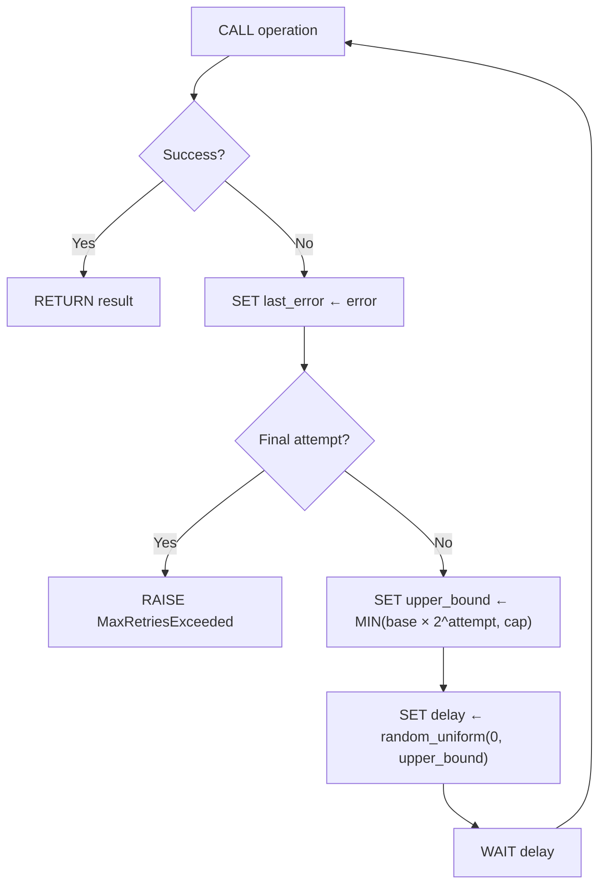

# retry.py — Concrete Spec

## Strategy

### Core Algorithm: Full Jitter Exponential Backoff

```pseudocode
FUNCTION retry(operation, config)
    SET last_error ← null

    FOR attempt ← 0 TO config.max_retries - 1
        TRY
            SET result ← CALL operation()
            RETURN result
        CATCH error
            SET last_error ← error

            IF attempt < config.max_retries - 1
                SET upper_bound ← MIN(config.base_delay × 2^attempt, config.max_delay)
                SET delay ← random_uniform(0, upper_bound)    // Full Jitter
                WAIT delay

    RAISE MaxRetriesExceeded(config.max_retries, last_error)
END FUNCTION
```

**Key invariant:** `random_uniform(0, upper_bound)` produces a value in `[0, upper_bound)`. This is the Full Jitter formula from the AWS Architecture Blog — it eliminates thundering herd by decorrelating retry timing across clients.

### Data Flow



## Pattern

- **Retry strategy**: Full Jitter exponential backoff (AWS-style)
- **Randomization**: Uniform distribution over `[0, min(cap, base * 2^attempt))`
- **State management**: Immutable config (frozen dataclass), mutable loop counter (local scope)
- **Error propagation**: Custom exception wrapping with cause chain (attempts + last_error)

## Type Sketch

```
RetryConfig {
    max_retries: int (> 0, default 3)
    base_delay: float (> 0, default 1.0)
    max_delay: float (>= base_delay, default 60.0)
    invariant: immutable after construction
}

MaxRetriesExceeded extends Exception {
    attempts: int
    last_error: Exception
    message: string (includes attempt count)
}

retry<T>(operation: () -> T, config: RetryConfig?) -> T
    throws MaxRetriesExceeded
```

## Lowering Notes

### Python
- `RetryConfig` as `@dataclass(frozen=True)` with `__post_init__` validation
- `random.uniform(0, upper_bound)` for Full Jitter delay — uses the module-level RNG, which is sufficient for retry jitter (not cryptographic)
- `time.sleep(delay)` for synchronous backoff
- `MaxRetriesExceeded` extends `Exception` with `attempts` and `last_error` instance attributes
- Type variable `T = TypeVar("T")` for generic return type
- `Optional[RetryConfig]` parameter with `None` default, constructed inside function body
