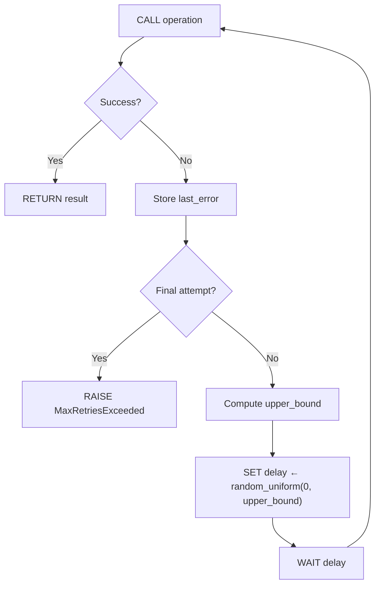

# Concrete Spec Skill

## Compiler IR Analogy

Unslop's spec-driven pipeline mirrors a compiler's multi-stage lowering:

| Compiler Layer | Unslop Layer | Artifact | Owns |
|---|---|---|---|
| Source Language | User Intent | Change request / conversation | The "Why" |
| High-Level IR | Abstract Spec (`*.spec.md`) | Intent-focused constraints | The "What" |
| **Mid-Level IR** | **Concrete Spec (`*.impl.md`)** | **Implementation strategy** | **The "How" (algorithm/pattern level)** |
| Low-Level IR / Target | Generated Code | Language-specific source | The "With What" |

The Abstract Spec describes **observable behavior** — what the code must do.
The Concrete Spec describes **implementation strategy** — the algorithm, pattern, and structural approach the Builder will use, without committing to language syntax.

This extra layer of indirection is where the most powerful optimizations happen: you catch logic errors in the strategy before wasting tokens on boilerplate, and you gain radical portability by keeping the "How" separate from the "With What."

---

## Format: Hybrid Structured Markdown

Concrete specs use the same Markdown ecosystem as abstract specs — same tooling, same diffing, same review workflow. The structure is more rigid to serve as a reliable "lowering target."

### File Naming

- Per-file: `<file>.impl.md` (e.g., `src/retry.py.impl.md`)
- Per-unit: `<dir>.unit.impl.md` (e.g., `src/auth/auth.unit.impl.md`)

### Frontmatter

```yaml
---
source-spec: src/retry.py.spec.md
target-language: python
ephemeral: true
complexity: standard
extends: shared/fastapi-async.impl.md
concrete-dependencies:
  - src/core/connection_pool.py.impl.md
---
```

| Field | Required | Description |
|---|---|---|
| `source-spec` | yes | Path to the abstract spec this concretizes |
| `target-language` | yes | Target language/platform for lowering |
| `ephemeral` | no | Default `true`. Set `false` when promoted via `/unslop:promote` or when complexity meets the project's `promote-threshold` |
| `complexity` | no | `low`, `medium`, or `high`. Compared against the project's `promote-threshold` for auto-promotion |
| `extends` | no | Path to a base `*.impl.md` whose sections are inherited. Child sections override parent sections. See Strategy Inheritance |
| `concrete-dependencies` | no | Paths to upstream `*.impl.md` files whose strategy choices affect this spec's lowering. Changes in upstream concrete specs trigger ghost staleness |

### Concrete Dependencies

Concrete dependencies track **implementation strategy links** — cases where this spec's lowering decisions depend on upstream implementation choices, not just upstream contracts.

Declare `concrete-dependencies` when:
- This spec's `## Strategy` assumes a specific concurrency model from an upstream module (sync vs async)
- This spec's `## Type Sketch` references internal types defined in an upstream concrete spec
- This spec's `## Lowering Notes` depend on library choices made in an upstream concrete spec

Do NOT declare concrete dependencies for:
- Contract-level dependencies (those belong in the abstract spec's `depends-on`)
- Ephemeral concrete specs (they don't persist to be tracked)
- Dependencies where only the abstract contract matters (algorithm choice is irrelevant)

**Example:** A service handler's concrete spec depends on the connection pool's concrete spec because the handler's strategy must match the pool's concurrency model:

```yaml
---
source-spec: src/api/handler.py.spec.md
target-language: python
ephemeral: false
complexity: high
concrete-dependencies:
  - src/core/connection_pool.py.impl.md
---
```

If `connection_pool.py.impl.md` changes from synchronous to async, `handler.py.impl.md` becomes **ghost-stale** — the abstract spec hasn't changed, but the implementation strategy is now invalid.

### Ghost Staleness

A managed file is **ghost-stale** when:
- Its abstract spec hash matches (spec hasn't changed)
- Its output hash matches (code hasn't been manually edited)
- But an upstream `concrete-dependency` has changed its strategy

Ghost staleness is invisible to the standard staleness check (which only tracks abstract spec hashes). It requires the orchestrator to hash and track concrete spec dependencies.

**Detection:** The orchestrator compares the hash of each `concrete-dependencies` entry against a stored `concrete-deps-hash` in the managed file's header (or in a sidecar tracking file).

**Resolution:** Re-run generation. Stage A.2 will re-derive the concrete spec from the updated upstream strategies, and Stage B will generate fresh code.

**In `/unslop:status`:** Ghost-stale files appear as a distinct state:

> `src/api/handler.py` — **ghost-stale** (upstream concrete spec changed: `src/core/connection_pool.py.impl.md`)

### Strategy Inheritance

Concrete specs can **extend** a base concrete spec to inherit shared sections. This eliminates duplication of `## Lowering Notes` and `## Pattern` across modules that share the same architectural approach.

#### Inheritance Model

```yaml
---
source-spec: src/api/users.py.spec.md
target-language: python
extends: shared/fastapi-async.impl.md
---
```

The `extends` field points to a **base concrete spec** — a `.impl.md` file that defines shared patterns and lowering conventions. The child inherits all sections from the parent, then overrides with its own.

#### Resolution Order (Child Wins)

| Section | Behavior |
|---|---|
| `## Strategy` | **Child only** — never inherited. Each module's algorithm is unique. If the child omits `## Strategy`, it is an error. |
| `## Pattern` | **Merge** — child patterns are appended to parent patterns. If the child redefines a pattern key (e.g., "Concurrency model"), the child's value wins. |
| `## Type Sketch` | **Child only** — types are module-specific. The parent's type sketch is available as reference but not merged. |
| `## Lowering Notes` | **Inherit + Override** — the child inherits all parent lowering notes. If the child defines its own `## Lowering Notes`, the child's entries override matching parent entries (keyed by language heading). Non-conflicting parent entries are preserved. |

#### Example: FastAPI Async Base

**Base spec (`shared/fastapi-async.impl.md`):**

```markdown
---
target-language: python
ephemeral: false
---

# FastAPI Async Base Strategy

## Pattern

- **Concurrency model**: Single-threaded async with cooperative yielding
- **DI pattern**: Annotated[T, Depends()] for all injected dependencies
- **Response model**: Pydantic BaseModel subclass, separate from ORM models
- **Error propagation**: HTTPException with structured detail payload

## Lowering Notes

### Python
- All route handlers are `async def`
- Use `asyncio.sleep()` not `time.sleep()`
- DB sessions via `async with` context manager
- `Annotated[T, Depends(provider)]` — never legacy `param = Depends()`
- Response schemas are Pydantic v2 `BaseModel` with `model_config`
```

**Child spec (`src/api/users.py.impl.md`):**

```markdown
---
source-spec: src/api/users.py.spec.md
target-language: python
extends: shared/fastapi-async.impl.md
ephemeral: false
complexity: medium
---

# users.py — Concrete Spec

## Strategy

### Core Algorithm

` ``pseudocode
FUNCTION list_users(filters, pagination, db_session)
    SET query ← BUILD base query FROM User model
    SET query ← APPLY filters TO query
    SET total ← COUNT query
    SET results ← EXECUTE query WITH pagination.offset, pagination.limit
    RETURN PaginatedResponse(items: results, total: total)
END FUNCTION
` ``

## Type Sketch

` ``
ListUsersFilters {
    name_contains: string? (optional)
    role: enum<admin, user, guest>? (optional)
    created_after: datetime? (optional)
}

PaginatedResponse<T> {
    items: list<T>
    total: int (>= 0)
}
` ``
```

**Resolved concrete spec** (what the Builder sees):
- `## Strategy` — from child (list_users algorithm)
- `## Pattern` — merged: child has no overrides, so all 4 parent patterns apply
- `## Type Sketch` — from child (ListUsersFilters, PaginatedResponse)
- `## Lowering Notes` — inherited from parent (async def, asyncio, Annotated DI, Pydantic v2)

The child spec is **38 lines** instead of the **70+** it would be without inheritance. Multiply by 5 endpoints and you've eliminated 160 lines of duplicated lowering notes.

#### Base Spec Rules

Base concrete specs (`shared/*.impl.md`) have special properties:

- They **do not require `source-spec`** — they are not tied to a specific abstract spec
- They **do not generate code** — they exist only to be inherited
- They are **always permanent** (`ephemeral: false` implied) — they are shared infrastructure
- They **appear in `/unslop:status`** under a `Base strategies:` section
- Changes to a base spec make all children **ghost-stale** (tracked via `extends` as an implicit concrete dependency)

#### Inheritance Chains

Concrete specs can form multi-level inheritance chains: `child extends parent extends grandparent`. Resolution applies bottom-up — the most specific (child) wins.

**Cycle detection:** The `extends` chain is validated by the same cycle detection used for `concrete-dependencies`. A cycle in `extends` (A extends B extends A) raises `CIRCULAR_DEPENDENCY_ERROR` during Phase 0a.1.

**Maximum depth:** 3 levels (grandparent → parent → child). Deeper chains indicate over-abstraction. If the Strategist needs more than 3 levels, it should flatten the hierarchy.

### Required Sections

#### `## Strategy`

The core of the concrete spec. Describes the algorithm, data flow, and structural pattern in **language-agnostic pseudocode**. This is not the abstract spec's "what" — it is the "how" at the algorithmic level.

Use fenced pseudocode blocks (` ```pseudocode `). **All pseudocode must comply with the Pseudocode Discipline defined in the `unslop/spec-language` skill.** Key requirements: capitalized keywords (`IF`, `SET`, `FUNCTION`), `←` for assignment, no language-specific syntax, no library calls.

````markdown
## Strategy

### Core Algorithm

```pseudocode
FUNCTION retry(operation, config)
    SET last_error ← null

    FOR attempt ← 0 TO config.max_retries - 1
        TRY
            SET result ← CALL operation()
            RETURN result
        CATCH error
            SET last_error ← error

            IF attempt < config.max_retries - 1
                SET upper_bound ← MIN(config.base_delay × 2^attempt, config.max_delay)
                SET delay ← random_uniform(0, upper_bound)    // Full Jitter
                WAIT delay

    RAISE MaxRetriesExceeded(config.max_retries, last_error)
END FUNCTION
```

### Data Flow


````

**Pseudocode is validated during Phase 0a.1 of pre-generation validation.** See the `unslop/spec-language` skill for the full Pseudocode Discipline specification, including structural rules, the Goldilocks abstraction level, and the implementation invariance requirement.

#### `## Pattern`

Name the design pattern or architectural approach. This is the "Rosetta Stone" — the part that stays the same when switching languages.

```markdown
## Pattern

- **Retry strategy**: Exponential backoff with jitter (decorrelated)
- **Concurrency model**: Single-threaded async with cooperative yielding
- **Error propagation**: Typed error wrapping with cause chain
- **State management**: Immutable config, mutable attempt counter (loop-scoped)
```

#### `## Type Sketch`

Structural type signatures without language-specific syntax. Use a generic type notation:

```markdown
## Type Sketch

RetryConfig {
    max_retries: int (> 0)
    base_delay: duration (> 0)
    max_delay: duration (>= base_delay)
    jitter_factor: float (0.0..1.0)
    retryable_errors: set<error_type>
}

RetryResult<T> = Success(value: T) | Failure(error: error, attempts: int)
```

#### `## Lowering Notes` (optional)

Language-specific considerations that the Builder should know. This is the only section that is NOT portable.

```markdown
## Lowering Notes

### Python
- Use `asyncio.sleep()` for delay in async context
- `RetryConfig` as a frozen dataclass
- Jitter via `random.uniform()`

### Go
- Use `time.Sleep()` for delay
- `RetryConfig` as a struct with exported fields
- Jitter via `math/rand`
```

---

## Lifecycle: Ephemeral by Default

The concrete spec is the Builder's **internal monologue** — it exists to improve generation quality, not to create maintenance burden.

### Generation Flow (Stage B.1)

1. Builder reads the Abstract Spec
2. Builder drafts a Concrete Spec as an in-worktree artifact (Stage B.1)
3. Builder generates code from both the Abstract Spec (constraints) and Concrete Spec (strategy)
4. If tests pass and `ephemeral: true`: the concrete spec is **discarded** with the worktree — it served its purpose
5. If tests pass and `ephemeral: false`: the concrete spec is **merged** with the generated code

### Complexity Scoring

The Strategist (Stage A.2) assesses complexity when drafting the Concrete Spec:

| Score | Criteria | Examples |
|---|---|---|
| `low` | Single algorithm, linear control flow, few types | CRUD endpoint, config loader, simple validation |
| `medium` | Multiple interacting algorithms, branching control flow, moderate type structure | Pagination with cursor management, rate limiter, connection pool |
| `high` | Complex state machines, concurrent logic, intricate type hierarchies, non-obvious invariants | Jitter backoff, auth handshake, distributed lock, event sourcing |

**Complexity is assessed, not declared.** The Strategist evaluates the algorithmic complexity of the implementation strategy, not the business importance.

### Auto-Promotion Threshold

The project-level threshold in `.unslop/config.json` determines which complexity levels trigger auto-promotion:

```json
{
  "promote-threshold": "high"
}
```

| `promote-threshold` | `low` complexity | `medium` complexity | `high` complexity |
|---|---|---|---|
| `"high"` (default) | ephemeral | ephemeral | **auto-promoted** |
| `"medium"` | ephemeral | **auto-promoted** | **auto-promoted** |
| `"low"` | **auto-promoted** | **auto-promoted** | **auto-promoted** |

When auto-promoted, the Strategist notifies the user but does not block:

> "Complexity assessed as `high` (meets promote threshold). Concrete spec will be retained as `<impl-path>`."

### When Concrete Specs Become Permanent

A concrete spec is promoted from ephemeral to permanent in these cases:

1. **Manual promotion**: User runs `/unslop:promote <spec-path>` (or `/unslop:harden --promote <spec-path>`) — the current implementation strategy is saved alongside the abstract spec
2. **Auto-promotion**: Assessed complexity meets or exceeds the project's `promote-threshold`
3. **Cross-language projects**: When `target-language` differs across generations of the same abstract spec, concrete specs are retained to preserve the language-specific lowering notes
4. **Builder-proposed upgrade**: If the Builder discovers during Stage B that the implementation is harder than the Strategist assessed (e.g., unexpected edge cases, concurrency concerns), it may propose a complexity upgrade in its DONE_WITH_CONCERNS report. The controlling session re-evaluates and promotes if the new score meets the threshold

### Permanent Concrete Spec Rules

When a concrete spec is permanent (`ephemeral: false`):

- It lives alongside the abstract spec: `src/retry.py.spec.md` + `src/retry.py.impl.md`
- It is version-controlled and code-reviewed
- Changes to the abstract spec trigger a staleness check on the concrete spec
- The Builder reads it as additional input during generation (but the abstract spec still wins on any conflict)
- It does NOT replace the abstract spec — both are maintained

### Staleness

A concrete spec is stale when:
- Its `source-spec` hash no longer matches the current abstract spec
- The abstract spec's constraints have changed in ways that invalidate the strategy

Stale concrete specs are regenerated by the Builder during the next generation cycle. The Builder may reuse parts of the old strategy if they remain valid.

---

## The Rosetta Stone Effect: Cross-Language Portability

The concrete spec enables radical portability. To switch from Python/FastAPI to Go/Echo:

1. The Abstract Spec stays **unchanged** — the "What" is language-agnostic
2. The Concrete Spec's `## Strategy`, `## Pattern`, and `## Type Sketch` stay **largely unchanged** — algorithms are portable
3. Only `## Lowering Notes` and `target-language` change
4. The Builder generates fresh code for the new target

This makes unslop a **cross-platform architectural tool**, not just a Python generator.

### Language Switch Workflow

```
/unslop:lower <spec-path> --language go
```

1. Read the existing concrete spec (if any) or generate one from the abstract spec
2. Preserve `## Strategy`, `## Pattern`, `## Type Sketch`
3. Regenerate `## Lowering Notes` for the target language
4. Update `target-language` in frontmatter
5. Dispatch Builder with the new concrete spec

---

## Raising: Code → Concrete → Abstract

During takeover, the concrete spec acts as a **Structural Archive** — an intermediate representation that preserves algorithmic intent while abstracting away syntax.

### Raising Flow (Takeover)

```
Existing Code
    ↓ raise to concrete
Concrete Spec (current "How")
    ↓ raise to abstract
Abstract Spec (original "Why")
```

1. **Code → Concrete**: Extract the algorithm, patterns, and type structure from existing code into a concrete spec. This captures "how it currently works" without committing to "how it should work."

2. **Concrete → Abstract**: Extract the observable behavior and constraints from the concrete spec into an abstract spec. This captures "what it does" without prescribing "how to do it."

This two-phase raising is more accurate than jumping directly from code to abstract spec, because:
- The concrete spec preserves algorithmic decisions that may be load-bearing
- The Architect can review the concrete spec to determine which algorithmic choices are intentional vs incidental
- If the raised abstract spec is then lowered through a different strategy, the original concrete spec serves as a reference for what was changed and why

### Lowering Flow (Re-generation)

```
Abstract Spec (modified "Why")
    ↓ lower to concrete
Concrete Spec (new "How")
    ↓ lower to code
Generated Code (new implementation)
```

The user can modify the "Why" (abstract spec) and let the Builder derive a new "How" (concrete spec) without losing the core business logic. The old concrete spec remains in the archive as a reference.

---

## Anti-Pattern: Spec Bloat (Double Maintenance)

The primary risk is requiring developers to approve two specs for every change. The ephemeral-by-default design mitigates this:

| Scenario | Abstract Spec | Concrete Spec | User Approval Steps |
|---|---|---|---|
| Standard change | Updated | Ephemeral (auto-generated, auto-discarded) | **1** (abstract only) |
| High-complexity change | Updated | Promoted (retained) | **2** (both) |
| Language switch | Unchanged | Regenerated with new target | **1** (concrete only) |
| Takeover | Drafted from code | Ephemeral (used during raising, then discarded) | **1** (abstract only) |

For the common case (standard complexity), the developer experience is **identical to today** — the concrete spec is invisible. It only surfaces when complexity warrants it or when the user explicitly requests it.

---

## Builder Instructions for Stage B.1

When generating code, the Builder follows this expanded sequence:

1. Read the Abstract Spec (source of truth for constraints)
2. Read the Concrete Spec if one exists and is permanent (`ephemeral: false`)
3. **If no permanent concrete spec exists**: Draft an ephemeral concrete spec in the worktree
   - Write `## Strategy` with pseudocode for the core algorithm
   - Write `## Pattern` identifying the design approach
   - Write `## Type Sketch` for structural types
   - Skip `## Lowering Notes` for ephemeral specs (the Builder already knows the target language)
4. Generate code from both specs:
   - Abstract Spec governs **what** (constraints, contracts, error behavior)
   - Concrete Spec governs **how** (algorithm, pattern, structure)
   - On conflict: Abstract Spec wins — always
5. Run tests
6. If `ephemeral: true`: do not include the concrete spec in the worktree merge
7. If `ephemeral: false`: include the concrete spec in the worktree merge

### Concrete Spec Quality Gate

The concrete spec must satisfy:
- Every constraint in the Abstract Spec has a corresponding strategy element
- The pseudocode is deterministic (no "choose an appropriate method")
- Type sketches are compatible with the Abstract Spec's contracts
- No language-specific syntax in `## Strategy` or `## Type Sketch`

This is a self-check, not a blocking validation. If the Builder cannot satisfy the quality gate, it proceeds with generation and reports DONE_WITH_CONCERNS.
