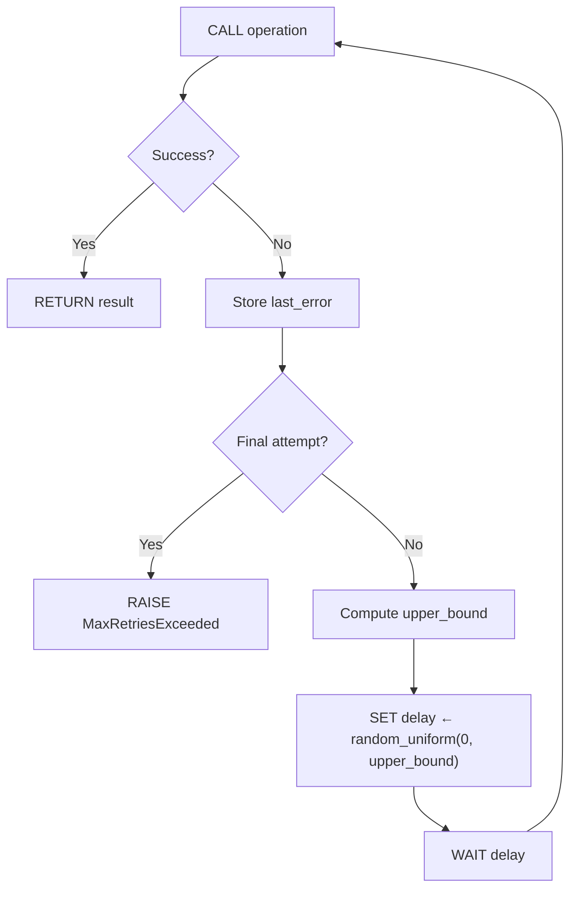

# Concrete Spec Skill

## Compiler IR Analogy

Unslop's spec-driven pipeline mirrors a compiler's multi-stage lowering:

| Compiler Layer | Unslop Layer | Artifact | Owns |
|---|---|---|---|
| Source Language | User Intent | Change request / conversation | The "Why" |
| High-Level IR | Abstract Spec (`*.spec.md`) | Intent-focused constraints | The "What" |
| **Mid-Level IR** | **Concrete Spec (`*.impl.md`)** | **Implementation strategy** | **The "How" (algorithm/pattern level)** |
| Low-Level IR / Target | Generated Code | Language-specific source | The "With What" |

The Abstract Spec describes **observable behavior** — what the code must do.
The Concrete Spec describes **implementation strategy** — the algorithm, pattern, and structural approach the Builder will use, without committing to language syntax.

This extra layer of indirection is where the most powerful optimizations happen: you catch logic errors in the strategy before wasting tokens on boilerplate, and you gain radical portability by keeping the "How" separate from the "With What."

---

## Format: Hybrid Structured Markdown

Concrete specs use the same Markdown ecosystem as abstract specs — same tooling, same diffing, same review workflow. The structure is more rigid to serve as a reliable "lowering target."

### File Naming

- Per-file: `<file>.impl.md` (e.g., `src/retry.py.impl.md`)
- Per-unit: `<dir>.unit.impl.md` (e.g., `src/auth/auth.unit.impl.md`)

### Frontmatter

```yaml
---
source-spec: src/retry.py.spec.md
target-language: python
ephemeral: true
complexity: standard
extends: shared/fastapi-async.impl.md
concrete-dependencies:
  - src/core/connection_pool.py.impl.md
---
```

For **multi-target lowering** (one spec → multiple languages), use `targets` instead of `target-language`:

```yaml
---
source-spec: src/auth/auth_logic.spec.md
ephemeral: false
complexity: high
targets:
  - path: src/api/auth.py
    language: python
    notes: "Use FastAPI HTTPException with structured detail"
  - path: frontend/src/api/auth.ts
    language: typescript
    notes: "Use Axios interceptors for error code mapping"
---
```

| Field | Required | Description |
|---|---|---|
| `source-spec` | yes | Path to the abstract spec this concretizes |
| `target-language` | yes* | Target language/platform for lowering. *Mutually exclusive with `targets` |
| `targets` | no* | List of target files for multi-target lowering. *Mutually exclusive with `target-language` |
| `targets[].path` | yes | Path to the managed file this target produces |
| `targets[].language` | yes | Language for this target (e.g., `python`, `typescript`, `go`) |
| `targets[].notes` | no | Target-specific lowering hints (supplements `## Lowering Notes`) |
| `ephemeral` | no | Default `true`. Set `false` when promoted via `/unslop:promote` or when complexity meets the project's `promote-threshold` |
| `complexity` | no | `low`, `medium`, or `high`. Compared against the project's `promote-threshold` for auto-promotion |
| `extends` | no | Path to a base `*.impl.md` whose sections are inherited. Child sections override parent sections. See Strategy Inheritance |
| `concrete-dependencies` | no | Paths to upstream `*.impl.md` files whose strategy choices affect this spec's lowering. Changes in upstream concrete specs trigger ghost staleness |

### Concrete Dependencies

Concrete dependencies track **implementation strategy links** — cases where this spec's lowering decisions depend on upstream implementation choices, not just upstream contracts.

Declare `concrete-dependencies` when:
- This spec's `## Strategy` assumes a specific concurrency model from an upstream module (sync vs async)
- This spec's `## Type Sketch` references internal types defined in an upstream concrete spec
- This spec's `## Lowering Notes` depend on library choices made in an upstream concrete spec

Do NOT declare concrete dependencies for:
- Contract-level dependencies (those belong in the abstract spec's `depends-on`)
- Ephemeral concrete specs (they don't persist to be tracked)
- Dependencies where only the abstract contract matters (algorithm choice is irrelevant)

**Example:** A service handler's concrete spec depends on the connection pool's concrete spec because the handler's strategy must match the pool's concurrency model:

```yaml
---
source-spec: src/api/handler.py.spec.md
target-language: python
ephemeral: false
complexity: high
concrete-dependencies:
  - src/core/connection_pool.py.impl.md
---
```

If `connection_pool.py.impl.md` changes from synchronous to async, `handler.py.impl.md` becomes **ghost-stale** — the abstract spec hasn't changed, but the implementation strategy is now invalid.

### Ghost Staleness

A managed file is **ghost-stale** when:
- Its abstract spec hash matches (spec hasn't changed)
- Its output hash matches (code hasn't been manually edited)
- But an upstream `concrete-dependency` has changed its strategy

Ghost staleness is invisible to the standard staleness check (which only tracks abstract spec hashes). It requires the orchestrator to hash and track concrete spec dependencies.

**Detection:** The managed file's `@unslop-managed` header stores a `concrete-manifest` — a per-dependency hash map written at generation time:

```
# concrete-manifest:src/core/pool.py.impl.md:a3f8c2e9b7d1,shared/base.impl.md:7f2e1b8a9c04
```

During `check_freshness()`, the orchestrator compares each entry's stored hash against the current hash of that dependency file. This enables **surgical** diagnosis — if `pool.py.impl.md` changed but `base.impl.md` didn't, only `pool.py.impl.md` is reported.

**Deep-chain tracing:** When a direct dependency has changed, the orchestrator walks upstream to find the root cause. If `service.impl.md` changed because its own upstream `utils.impl.md` changed, the diagnostic reports:

> `upstream service.impl.md changed (via utils.impl.md)`

This prevents the "honest diagnostic" problem where the user is directed to check a file that appears untouched — the chain trace points them to the actual root cause.

**Backward compatibility:** Files with the legacy `concrete-deps-hash` (a single coarse hash of all transitive deps) are still supported. The orchestrator falls back to the old `_identify_changed_deps()` logic for these files, which reports all deps as suspects. New generations write `concrete-manifest` instead.

**Resolution:** Re-run generation. Stage A.2 will re-derive the concrete spec from the updated upstream strategies, and Stage B will generate fresh code.

**In `/unslop:status`:** Ghost-stale files appear as a distinct state with the root cause chain:

> `src/api/handler.py` — **ghost-stale** (upstream `src/core/pool.py.impl.md` changed (via `src/db/connection.py.impl.md`))

### Multi-Target Lowering (1-to-Many)

A single Abstract Spec can describe a contract that must be implemented in multiple languages simultaneously. The Concrete Spec's `targets` field enables this by listing each output file with its language and target-specific notes.

#### The Coordination Problem

When `user_login.spec.md` says "return error code AUTH_EXPIRED on token expiry":
- The Python backend must `raise HTTPException(status_code=401, detail={"code": "AUTH_EXPIRED"})`
- The TypeScript frontend must `if (error.response.data.code === "AUTH_EXPIRED") { redirect("/login") }`

If these drift, the app breaks — even if both files independently "pass" their spec-to-code tests. Multi-target lowering solves this by ensuring both implementations are derived from the **same Strategy and Type Sketch**, differing only in `## Lowering Notes`.

#### How It Works

**1. The concrete spec uses `targets` instead of `target-language`:**

```yaml
---
source-spec: src/auth/auth_logic.spec.md
targets:
  - path: src/api/auth.py
    language: python
    notes: "Use FastAPI HTTPException with structured detail"
  - path: frontend/src/api/auth.ts
    language: typescript
    notes: "Use Axios interceptors for error code mapping"
---
```

**2. The `## Lowering Notes` section has per-language headings:**

```markdown
## Lowering Notes

### Python
- `raise HTTPException(status_code=401, detail={"code": "AUTH_EXPIRED"})`
- Auth middleware via `Annotated[User, Depends(get_current_user)]`

### TypeScript
- Error codes as `const enum AuthErrorCode { ... }` for tree-shaking
- Axios response interceptor maps codes to redirect actions
- Token refresh via `async function refreshToken(): Promise<string>`
```

**3. Stage B dispatches parallel Builders — one per target:**

Each Builder receives:
- The **same** Abstract Spec (contract constraints)
- The **same** `## Strategy` and `## Type Sketch` (algorithmic intent)
- **Different** `## Lowering Notes` (filtered to its target language)
- **Different** `targets[].notes` (target-specific hints)

**4. Atomic merge — all succeed or all are discarded:**

The controlling session waits for all parallel Builders to complete:
- If **all** report DONE with green tests: merge all worktrees, commit atomically
- If **any** reports BLOCKED or fails: discard **all** worktrees, revert staged spec

This prevents partial updates where the backend changes but the frontend doesn't.

#### Parallel Worktree Dispatch

Each target gets its own Builder in a separate worktree. Git supports concurrent worktrees natively — no lock contention as long as each is on a different branch (`unslop/builder/<target-path-hash>`).

```
Architect (Stage A)
    ↓
Strategist (Stage A.2) — single concrete spec
    ↓
┌─────────────────────────────────────────────────┐
│  Parallel Builder Dispatch + Status Board       │
│                                                 │
│  [1/2] auth.py   (python)     building...       │
│  [2/2] auth.ts   (typescript) building...       │
│                                                 │
│  Worktree 1 (python)    Worktree 2 (ts)         │
│  ┌─────────────┐        ┌─────────────┐        │
│  │ Read spec   │        │ Read spec   │        │
│  │ Read impl   │        │ Read impl   │        │
│  │ Filter LN   │        │ Filter LN   │        │
│  │ Generate .py│        │ Generate .ts│        │
│  │ Run pytest  │        │ Run vitest  │        │
│  │ DONE ✓      │        │ DONE ✓      │        │
│  └─────────────┘        └─────────────┘        │
│                                                 │
│  [1/2] auth.py   (python)     DONE (14t, 3.2s) │
│  [2/2] auth.ts   (typescript) DONE (8t, 1.7s)  │
└─────────────────────────────────────────────────┘
    ↓
Cross-Target Consistency Check
    ↓
Atomic Merge (all or nothing)
    ↓
Single Commit: spec + auth.py + auth.ts
```

The status board provides real-time visibility into parallel Builder execution. See the `unslop/generation` skill for the full status board specification.

#### Cross-Target Contract Consistency

After all Builders complete but before merging, the controlling session runs a **cross-target consistency check**:

- Do all targets use the same error codes / status values?
- Do all targets agree on the shape of shared data structures (from `## Type Sketch`)?
- Do all targets handle the same edge cases?

This is a model-assisted check (not automated) — the controlling session reads all generated outputs and flags discrepancies. It runs after Builder success but before the atomic commit.

#### Staleness

When a multi-target concrete spec changes:
- **All** targets are marked stale simultaneously
- `/unslop:status` shows them grouped under the concrete spec:

```
  stale    src/api/auth.py          <- src/auth/auth_logic.spec.md [target 1/2]
  stale    frontend/src/api/auth.ts <- src/auth/auth_logic.spec.md [target 2/2]
           concrete spec: src/auth/auth_logic.impl.md
```

#### When NOT to Use Multi-Target

Multi-target lowering is for **shared contracts** — the same business logic implemented across language boundaries. Do NOT use it for:

- Unrelated files that happen to share a spec (use per-file specs instead)
- Frontend and backend that communicate via a well-defined API (the API schema is the contract — use separate specs for each side)
- Different implementations of the same algorithm in the same language (use unit specs)

The right test: "If I change an error code in the abstract spec, must BOTH files update atomically?" If yes → multi-target. If no → separate specs.

### Strategy Inheritance

Concrete specs can **extend** a base concrete spec to inherit shared sections. This eliminates duplication of `## Lowering Notes` and `## Pattern` across modules that share the same architectural approach.

#### Inheritance Model

```yaml
---
source-spec: src/api/users.py.spec.md
target-language: python
extends: shared/fastapi-async.impl.md
---
```

The `extends` field points to a **base concrete spec** — a `.impl.md` file that defines shared patterns and lowering conventions. The child inherits **context** (metadata and lowering notes) from the parent, but never the **core algorithm**. A child's `## Strategy` and `## Type Sketch` are always its own — a silent fallback to the parent's algorithm is a bug, not a feature.

#### Section-Specific Inheritance Policies

Each section follows one of three inheritance behaviors:

| Policy | Sections | Behavior |
|---|---|---|
| **Strict Child-Only** | `## Strategy`, `## Type Sketch`, `## Representation Invariants`, `## Safety Contracts`, `## Concurrency Model`, `## State Machine` | Parent section is **purged** during resolution. If the child omits it, the resolved spec has no such section. The parent's version is never silently inherited. For Strategy and Type Sketch, absence triggers Phase 0a.1 validation failure. For architectural invariant sections, absence is valid (the child simply has no such constraints). |
| **Additive** | `## Lowering Notes` | Parent and child are **merged**. Child entries override matching parent entries (keyed by language heading). Non-conflicting parent entries are preserved. |
| **Overridable** | `## Pattern` | Child replaces parent if present. If the child omits `## Pattern`, the parent's version persists. |

#### Resolution Algorithm: `resolve_inherited_sections()`

```pseudocode
FUNCTION resolve_inherited_sections(parent_sections, child_sections)
    SET STRICT_CHILD_ONLY ← {"Strategy", "Type Sketch"}

    // 1. Start with parent sections
    SET resolved ← COPY(parent_sections)

    // 2. Purge strict child-only sections from the parent copy
    FOR EACH section IN STRICT_CHILD_ONLY
        REMOVE section FROM resolved

    // 3. Apply child overrides/additions
    FOR EACH (title, content) IN child_sections
        IF title = "Lowering Notes" AND title EXISTS IN parent_sections
            SET resolved[title] ← parent_sections[title] + "\n" + content
        ELSE
            SET resolved[title] ← content

    RETURN resolved
END FUNCTION
```

**Key invariant:** After resolution, `## Strategy` and `## Type Sketch` can only contain content the child explicitly defined. If the child omitted them, they are absent — and the existing Phase 0a.1 linter catches the missing mandatory `## Strategy` section.

#### The "Forgetful Child" Failure Mode

This is the scenario the strict policy prevents:

1. **Parent** (`base_api.impl.md`) defines a generic fetch strategy
2. **Child** (`user_api.impl.md`) extends `base_api` but omits its own `## Strategy`
3. **Resolution:** `resolve_inherited_sections()` purges the parent's generic fetch. The resolved spec has no `## Strategy`
4. **Validation:** Phase 0a.1 aborts with: `FATAL: user_api.impl.md is missing mandatory ## Strategy section`

Without the strict policy, the child would silently inherit the parent's generic fetch algorithm — violating Implementation Invariance and producing code that "works" but doesn't match the child module's actual requirements.

#### Example: FastAPI Async Base

**Base spec (`shared/fastapi-async.impl.md`):**

```markdown
---
target-language: python
ephemeral: false
---

# FastAPI Async Base Strategy

## Pattern

- **Concurrency model**: Single-threaded async with cooperative yielding
- **DI pattern**: Annotated[T, Depends()] for all injected dependencies
- **Response model**: Pydantic BaseModel subclass, separate from ORM models
- **Error propagation**: HTTPException with structured detail payload

## Lowering Notes

### Python
- All route handlers are `async def`
- Use `asyncio.sleep()` not `time.sleep()`
- DB sessions via `async with` context manager
- `Annotated[T, Depends(provider)]` — never legacy `param = Depends()`
- Response schemas are Pydantic v2 `BaseModel` with `model_config`
```

**Child spec (`src/api/users.py.impl.md`):**

```markdown
---
source-spec: src/api/users.py.spec.md
target-language: python
extends: shared/fastapi-async.impl.md
ephemeral: false
complexity: medium
---

# users.py — Concrete Spec

## Strategy

### Core Algorithm

` ``pseudocode
FUNCTION list_users(filters, pagination, db_session)
    SET query ← BUILD base query FROM User model
    SET query ← APPLY filters TO query
    SET total ← COUNT query
    SET results ← EXECUTE query WITH pagination.offset, pagination.limit
    RETURN PaginatedResponse(items: results, total: total)
END FUNCTION
` ``

## Type Sketch

` ``
ListUsersFilters {
    name_contains: string? (optional)
    role: enum<admin, user, guest>? (optional)
    created_after: datetime? (optional)
}

PaginatedResponse<T> {
    items: list<T>
    total: int (>= 0)
}
` ``
```

**Resolved concrete spec** (what the Builder sees after `resolve_inherited_sections()`):
- `## Strategy` — from child only (list_users algorithm). Parent's strategy was **purged** — strict child-only policy
- `## Pattern` — from parent (child has no overrides, so all 4 parent patterns persist — overridable policy)
- `## Type Sketch` — from child only (ListUsersFilters, PaginatedResponse). Parent's type sketch was **purged** — strict child-only policy
- `## Lowering Notes` — inherited from parent (async def, asyncio, Annotated DI, Pydantic v2) — additive policy, child had none to merge

The child spec is **38 lines** instead of the **70+** it would be without inheritance. Multiply by 5 endpoints and you've eliminated 160 lines of duplicated lowering notes.

#### Base Spec Rules

Base concrete specs (`shared/*.impl.md`) have special properties:

- They **do not require `source-spec`** — they are not tied to a specific abstract spec
- They **do not generate code** — they exist only to be inherited
- They are **always permanent** (`ephemeral: false` implied) — they are shared infrastructure
- They **appear in `/unslop:status`** under a `Base strategies:` section
- Changes to a base spec make all children **ghost-stale** (tracked via `extends` as an implicit concrete dependency)

#### Inheritance Chains

Concrete specs can form multi-level inheritance chains: `child extends parent extends grandparent`. Resolution applies bottom-up via `resolve_inherited_sections()` at each level. The strict child-only policy applies at every level — a grandparent's `## Strategy` can never leak through to a grandchild, even transitively.

**Cycle detection:** The `extends` chain is validated by the same cycle detection used for `concrete-dependencies`. A cycle in `extends` (A extends B extends A) raises `CIRCULAR_DEPENDENCY_ERROR` during Phase 0a.1.

**Maximum depth:** 3 levels (grandparent → parent → child). Deeper chains indicate over-abstraction. If the Strategist needs more than 3 levels, it should flatten the hierarchy.

### Required Sections

#### `## Strategy`

The core of the concrete spec. Describes the algorithm, data flow, and structural pattern. This is not the abstract spec's "what" -- it is the "how" at the algorithmic level.

**Pseudocode is optional.** Use pseudocode blocks for non-standard algorithms where the logic is genuinely complex. For standard patterns (retry with backoff, CRUD operations, request routing), a brief prose description or a reference to the Pattern section is sufficient. The Builder already knows how to implement standard algorithms -- pseudocode for them adds noise.

When pseudocode is used, it must comply with the Pseudocode Discipline defined in the `unslop/spec-language` skill (capitalized keywords, `←` for assignment, no language-specific syntax). Use `--force-pseudocode` to bypass linter false positives when language-flavored notation is unavoidable.

**For files with structural constraints** (memory layout, unsafe operations, concurrency), the Strategy section can be minimal -- the architectural invariant sections (Representation Invariants, Safety Contracts, Concurrency Model, State Machine) carry the load-bearing information. A one-line Strategy like "Standard allocator dispatch with pointer-encoded handle selection" is fine when the real complexity is in the layout and safety contracts.

````markdown
## Strategy

### Core Algorithm

```pseudocode
FUNCTION retry(operation, config)
    SET last_error ← null

    FOR attempt ← 0 TO config.max_retries - 1
        TRY
            SET result ← CALL operation()
            RETURN result
        CATCH error
            SET last_error ← error

            IF attempt < config.max_retries - 1
                SET upper_bound ← MIN(config.base_delay × 2^attempt, config.max_delay)
                SET delay ← random_uniform(0, upper_bound)    // Full Jitter
                WAIT delay

    RAISE MaxRetriesExceeded(config.max_retries, last_error)
END FUNCTION
```

### Data Flow


````

**Pseudocode is validated during Phase 0a.1 of pre-generation validation.** See the `unslop/spec-language` skill for the full Pseudocode Discipline specification, including structural rules, the Goldilocks abstraction level, and the implementation invariance requirement.

#### `## Pattern`

Name the design pattern or architectural approach. This is the "Rosetta Stone" — the part that stays the same when switching languages.

```markdown
## Pattern

- **Retry strategy**: Exponential backoff with jitter (decorrelated)
- **Concurrency model**: Single-threaded async with cooperative yielding
- **Error propagation**: Typed error wrapping with cause chain
- **State management**: Immutable config, mutable attempt counter (loop-scoped)
```

#### `## Type Sketch`

Structural type signatures without language-specific syntax. Use a generic type notation:

```markdown
## Type Sketch

RetryConfig {
    max_retries: int (> 0)
    base_delay: duration (> 0)
    max_delay: duration (>= base_delay)
    jitter_factor: float (0.0..1.0)
    retryable_errors: set<error_type>
}

RetryResult<T> = Success(value: T) | Failure(error: error, attempts: int)
```

#### `## Lowering Notes` (optional)

Language-specific considerations that the Builder should know. This is the only section that is NOT portable.

```markdown
## Lowering Notes

### Python
- Use `asyncio.sleep()` for delay in async context
- `RetryConfig` as a frozen dataclass
- Jitter via `random.uniform()`

### Go
- Use `time.Sleep()` for delay
- `RetryConfig` as a struct with exported fields
- Jitter via `math/rand`
```

### Optional Sections: Architectural Invariants

These sections document **non-observable constraints** -- things that are load-bearing but invisible to tests. A wrong return value fails a test; a wrong memory layout causes silent corruption under load. Use these sections when the file has structural constraints that the Builder must respect but the abstract spec cannot express.

**When to include:** If the file involves memory layout, unsafe operations, concurrency primitives, or protocol state machines. If the file is pure business logic with no structural constraints, skip these sections -- the Strategy and Type Sketch are sufficient.

#### `## Representation Invariants` (optional)

Memory layout, alignment, field offsets, and size constraints. Essential for FFI, cache-line optimization, and any code where the physical structure matters.

Use language-agnostic notation with explicit field offsets:

```markdown
## Representation Invariants

ObjectHeader:
  LAYOUT: C-compatible, ALIGN 8, SIZE 16 (on 64-bit)
  FIELD_OFFSET 0: flags (2 bytes, bitmask)
  FIELD_OFFSET 2: layout_id (2 bytes, index into type table)
  FIELD_OFFSET 4: body_size (4 bytes, object payload size)
  FIELD_OFFSET 8: vtable (8 bytes, pointer to dispatch table)

MutatorHandle:
  LAYOUT: transparent wrapper over non-zero pointer-sized integer
  INVARIANT: zero is never valid (distinguishes initialized from uninitialized)
  INTERPRETATION: raw pointer (allocator A) or thread ID (allocator B)
```

#### `## Safety Contracts` (optional)

Preconditions, postconditions, and violation consequences for unsafe operations. Every unsafe block should have a corresponding contract entry.

```markdown
## Safety Contracts

OP read_header(ptr):
  REQUIRES: ptr is non-null, aligned to 8, points to initialized ObjectHeader
  ENSURES: returned header is a bitwise copy of the memory at ptr
  VIOLATED_BY: null ptr (undefined behavior), unaligned ptr (undefined behavior),
               dangling ptr (use-after-free)

OP write_barrier(old_ref, new_ref):
  REQUIRES: both refs are valid managed pointers or null
  ENSURES: GC is notified of the reference mutation before the next collection
  VIOLATED_BY: unmanaged pointer passed as ref (silent memory leak or dangling ref)
```

#### `## Concurrency Model` (optional)

Atomic operations with their memory orderings and rationale. Locks with their contention model. The "why" matters as much as the "what" -- a Builder that changes `Relaxed` to `SeqCst` "to be safe" may introduce unnecessary contention.

```markdown
## Concurrency Model

ATOMIC_VAR next_mutator_id:
  TYPE: atomic unsigned integer
  ORDERING: Relaxed
  RATIONALE: IDs need uniqueness, not happens-before. Relaxed is sufficient
             because the ID is never used to synchronize other memory accesses.

LOCK mutator_registry:
  TYPE: lazy-initialized mutex over hash map
  INIT: once-lock (no allocation until first mutator registers)
  CONTENTION: Mutex not RwLock -- writes are as frequent as reads
  POISONING: poisoned lock returns empty (graceful degradation, not panic)
```

#### `## State Machine` (optional)

Formal state transitions for protocol implementations. Replaces brittle conditional logic with a verifiable transition table. Use arrow notation for readability.

```markdown
## State Machine

STATES: {Idle, Running, RequestReceived, AtSafepoint, Completed}

TRANSITIONS:
  Idle -> Running                [ON: start]
  Running -> RequestReceived     [ON: handshake_request]
  RequestReceived -> AtSafepoint [ON: safepoint_reached]
  AtSafepoint -> Completed       [ON: coordinator_ack]
  Completed -> Idle              [ON: reset]

INVALID:
  Running -> Completed           (must go through safepoint)
  AtSafepoint -> Running         (must complete before resuming)

INITIAL: Idle
TERMINAL: none (cyclic protocol)
```

---

## Lifecycle: Ephemeral by Default

The concrete spec is the Builder's **internal monologue** — it exists to improve generation quality, not to create maintenance burden.

### Generation Flow (Stage B.1)

1. Builder reads the Abstract Spec
2. Builder drafts a Concrete Spec as an in-worktree artifact (Stage B.1)
3. Builder generates code from both the Abstract Spec (constraints) and Concrete Spec (strategy)
4. If tests pass and `ephemeral: true`: the concrete spec is **discarded** with the worktree — it served its purpose
5. If tests pass and `ephemeral: false`: the concrete spec is **merged** with the generated code

### Complexity Scoring

The Strategist (Stage A.2) assesses complexity when drafting the Concrete Spec:

| Score | Criteria | Examples |
|---|---|---|
| `low` | Single algorithm, linear control flow, few types | CRUD endpoint, config loader, simple validation |
| `medium` | Multiple interacting algorithms, branching control flow, moderate type structure | Pagination with cursor management, rate limiter, connection pool |
| `high` | Complex state machines, concurrent logic, intricate type hierarchies, non-obvious invariants | Jitter backoff, auth handshake, distributed lock, event sourcing |

**Complexity is assessed, not declared.** The Strategist evaluates the algorithmic complexity of the implementation strategy, not the business importance.

### Auto-Promotion Threshold

The project-level threshold in `.unslop/config.json` determines which complexity levels trigger auto-promotion:

```json
{
  "promote-threshold": "high"
}
```

| `promote-threshold` | `low` complexity | `medium` complexity | `high` complexity |
|---|---|---|---|
| `"high"` (default) | ephemeral | ephemeral | **auto-promoted** |
| `"medium"` | ephemeral | **auto-promoted** | **auto-promoted** |
| `"low"` | **auto-promoted** | **auto-promoted** | **auto-promoted** |

When auto-promoted, the Strategist notifies the user but does not block:

> "Complexity assessed as `high` (meets promote threshold). Concrete spec will be retained as `<impl-path>`."

### When Concrete Specs Become Permanent

A concrete spec is promoted from ephemeral to permanent in these cases:

1. **Manual promotion**: User runs `/unslop:promote <spec-path>` (or `/unslop:harden --promote <spec-path>`) — the current implementation strategy is saved alongside the abstract spec
2. **Auto-promotion**: Assessed complexity meets or exceeds the project's `promote-threshold`
3. **Cross-language projects**: When `target-language` differs across generations of the same abstract spec, concrete specs are retained to preserve the language-specific lowering notes
4. **Builder-proposed upgrade**: If the Builder discovers during Stage B that the implementation is harder than the Strategist assessed (e.g., unexpected edge cases, concurrency concerns), it may propose a complexity upgrade in its DONE_WITH_CONCERNS report. The controlling session re-evaluates and promotes if the new score meets the threshold

### Permanent Concrete Spec Rules

When a concrete spec is permanent (`ephemeral: false`):

- It lives alongside the abstract spec: `src/retry.py.spec.md` + `src/retry.py.impl.md`
- It is version-controlled and code-reviewed
- Changes to the abstract spec trigger a staleness check on the concrete spec
- The Builder reads it as additional input during generation (but the abstract spec still wins on any conflict)
- It does NOT replace the abstract spec — both are maintained

### Staleness

A concrete spec is stale when:
- Its `source-spec` hash no longer matches the current abstract spec
- The abstract spec's constraints have changed in ways that invalidate the strategy

Stale concrete specs are regenerated by the Builder during the next generation cycle. The Builder may reuse parts of the old strategy if they remain valid.

---

## The Rosetta Stone Effect: Cross-Language Portability

The concrete spec enables radical portability. To switch from Python/FastAPI to Go/Echo:

1. The Abstract Spec stays **unchanged** — the "What" is language-agnostic
2. The Concrete Spec's `## Strategy`, `## Pattern`, and `## Type Sketch` stay **largely unchanged** — algorithms are portable
3. Only `## Lowering Notes` and `target-language` change
4. The Builder generates fresh code for the new target

This makes unslop a **cross-platform architectural tool**, not just a Python generator.

### Language Switch Workflow

> **Note:** `/unslop:lower` is a planned future command. The current manual workflow is:

1. Update `target-language` in the concrete spec's frontmatter to the desired language (e.g., `go`)
2. Update `## Lowering Notes` to reflect the new target language's idioms and conventions
3. Run `/unslop:sync` to regenerate the managed file from the updated concrete spec

The `## Strategy`, `## Pattern`, and `## Type Sketch` sections typically require no changes -- algorithms are portable across languages.

---

## Raising: Code → Concrete → Abstract

During takeover, the concrete spec acts as a **Structural Archive** — an intermediate representation that preserves algorithmic intent while abstracting away syntax.

### Raising Flow (Takeover)

```
Existing Code
    ↓ raise to concrete
Concrete Spec (current "How")
    ↓ raise to abstract
Abstract Spec (original "Why")
```

1. **Code → Concrete**: Extract the algorithm, patterns, and type structure from existing code into a concrete spec. This captures "how it currently works" without committing to "how it should work."

2. **Concrete → Abstract**: Extract the observable behavior and constraints from the concrete spec into an abstract spec. This captures "what it does" without prescribing "how to do it."

This two-phase raising is more accurate than jumping directly from code to abstract spec, because:
- The concrete spec preserves algorithmic decisions that may be load-bearing
- The Architect can review the concrete spec to determine which algorithmic choices are intentional vs incidental
- If the raised abstract spec is then lowered through a different strategy, the original concrete spec serves as a reference for what was changed and why

### Lowering Flow (Re-generation)

```
Abstract Spec (modified "Why")
    ↓ lower to concrete
Concrete Spec (new "How")
    ↓ lower to code
Generated Code (new implementation)
```

The user can modify the "Why" (abstract spec) and let the Builder derive a new "How" (concrete spec) without losing the core business logic. The old concrete spec remains in the archive as a reference.

---

## Anti-Pattern: Spec Bloat (Double Maintenance)

The primary risk is requiring developers to approve two specs for every change. The ephemeral-by-default design mitigates this:

| Scenario | Abstract Spec | Concrete Spec | User Approval Steps |
|---|---|---|---|
| Standard change | Updated | Ephemeral (auto-generated, auto-discarded) | **1** (abstract only) |
| High-complexity change | Updated | Promoted (retained) | **2** (both) |
| Language switch | Unchanged | Regenerated with new target | **1** (concrete only) |
| Takeover | Drafted from code | Ephemeral (used during raising, then discarded) | **1** (abstract only) |

For the common case (standard complexity), the developer experience is **identical to today** — the concrete spec is invisible. It only surfaces when complexity warrants it or when the user explicitly requests it.

---

## Builder Instructions for Stage B.1

When generating code, the Builder follows this expanded sequence:

1. Read the Abstract Spec (source of truth for constraints)
2. Read the Concrete Spec if one exists and is permanent (`ephemeral: false`)
3. **If no permanent concrete spec exists**: Draft an ephemeral concrete spec in the worktree
   - Write `## Strategy` with pseudocode for the core algorithm
   - Write `## Pattern` identifying the design approach
   - Write `## Type Sketch` for structural types
   - Skip `## Lowering Notes` for ephemeral specs (the Builder already knows the target language)
4. Generate code from both specs:
   - Abstract Spec governs **what** (constraints, contracts, error behavior)
   - Concrete Spec governs **how** (algorithm, pattern, structure)
   - On conflict: Abstract Spec wins — always
5. Run tests
6. If `ephemeral: true`: do not include the concrete spec in the worktree merge
7. If `ephemeral: false`: include the concrete spec in the worktree merge

### Concrete Spec Quality Gate

The concrete spec must satisfy:
- Every constraint in the Abstract Spec has a corresponding strategy element
- The pseudocode is deterministic (no "choose an appropriate method")
- Type sketches are compatible with the Abstract Spec's contracts
- No language-specific syntax in `## Strategy` or `## Type Sketch`

This is a self-check, not a blocking validation. If the Builder cannot satisfy the quality gate, it proceeds with generation and reports DONE_WITH_CONCERNS.
